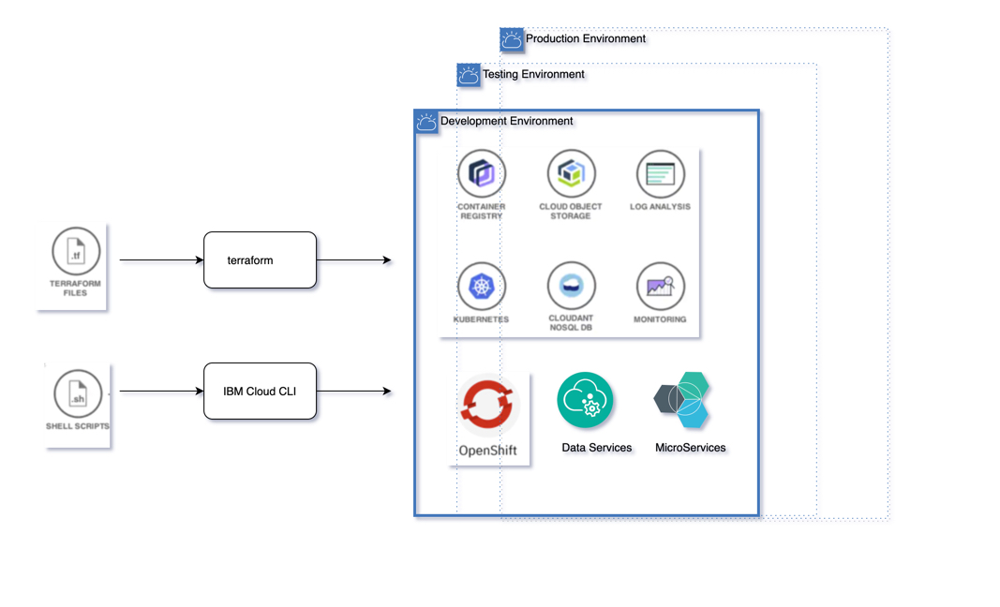
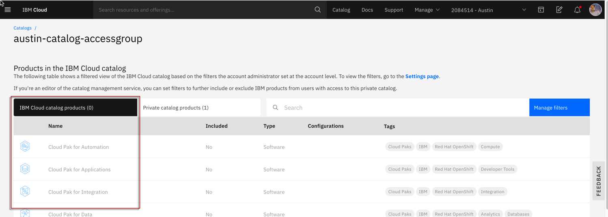
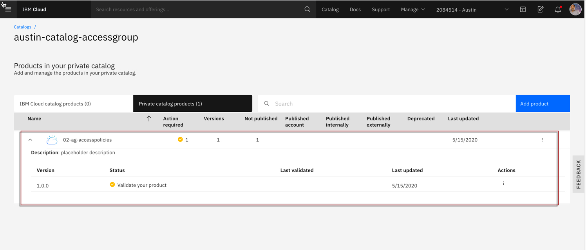
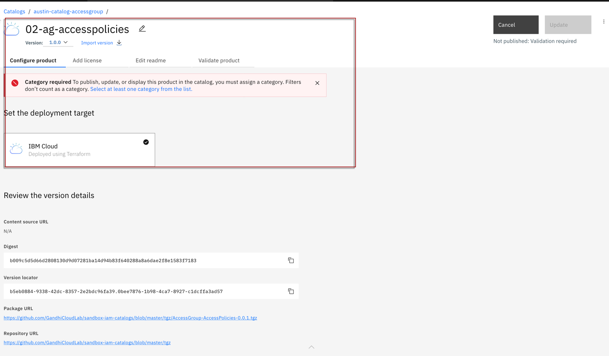
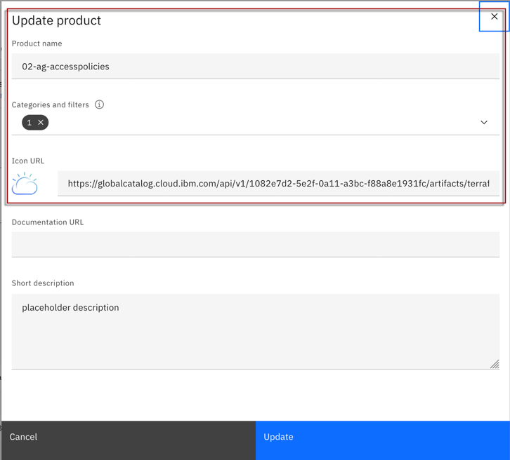
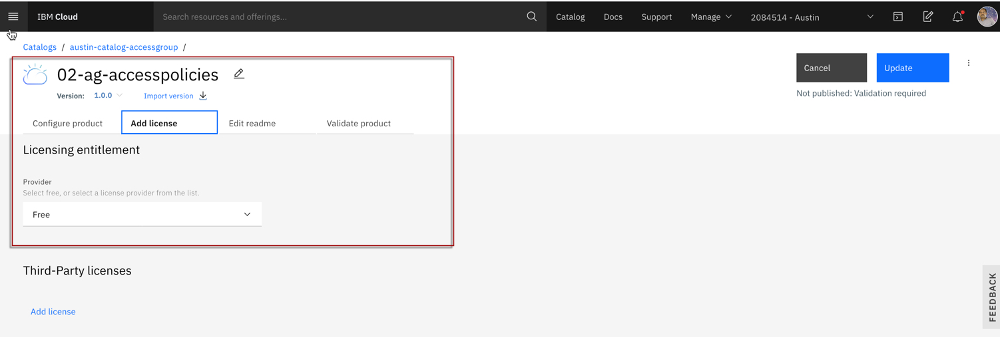
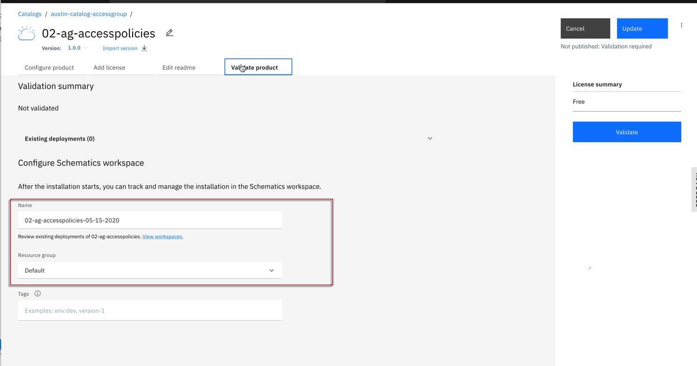
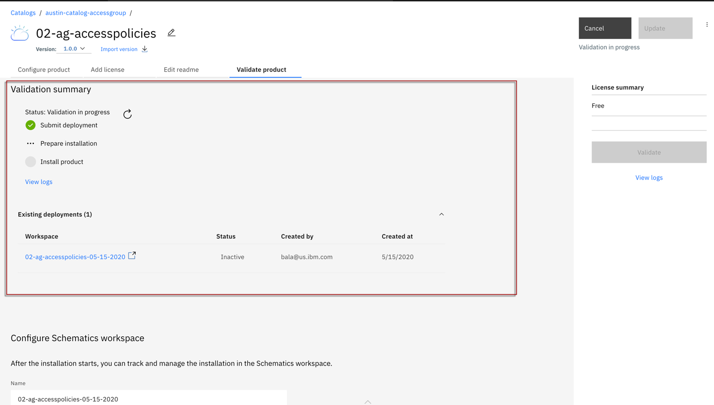
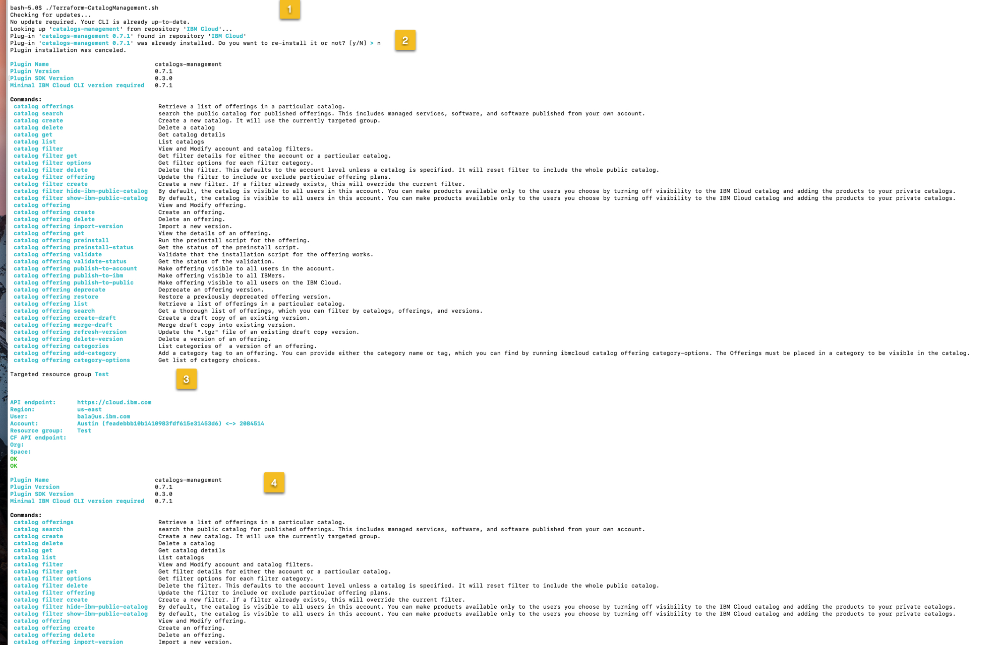

# Catalog Access Management

## Architecture
  

### 1. The catalog managment is available in latest cli. You need to update your ibmcloud cli using.

ibmcloud update

### 2. Install the plugin

ibmcloud plugin install catalogs-management

ibmcloud plugin show catalogs-management

### 3. Set your target resource group.

ibmcloud target -g <Resource Group Name> 

### 4. Create a Private catalog

ibmcloud catalog create --name <Catalog Name> --description <Description> hide-ibm-public-catalog

### 5. Create a Tile. You need to pass .tgz file as an argument.

ibmcloud catalog offering create --catalog <Catalog Name> --zipurl <Tile URL>

ibmcloud catalog offerings --catalog austin-catalog-accessgroup

### 6. Verify the private catalog that is created via IBM Public Cloud console

  

  

  

### 7. Follow the walkthru of screen and Update catalogies, validate, publish and all.

  

  

  

  

  

### 8. You will find other possible commands related to that by running this help command.

ibmcloud plugin show catalogs-management

### 9. Here is the list commands.

ibmcloud plugin show catalogs-management

SHOW ME COMMAND SUMMARY

  
Plugin Name                              catalogs-management
Plugin Version                           0.7.1
Plugin SDK Version                       0.3.0
Minimal IBM Cloud CLI version required   0.7.1

 Commands:
    catalog offerings                        Retrieve a list of offerings in a particular catalog.
    catalog search                           search the public catalog for published offerings. This includes managed services, software, and software published from your own account.
    catalog create                           Create a new catalog. It will use the currently targeted group.
    catalog delete                           Delete a catalog
    catalog get                              Get catalog details
    catalog list                             List catalogs
    catalog filter                           View and Modify account and catalog filters.
    catalog filter get                       Get filter details for either the account or a particular catalog.
    catalog filter options                   Get filter options for each filter category.
    catalog filter delete                    Delete the filter. This defaults to the account level unless a catalog is specified. It will reset filter to include the whole public catalog.
    catalog filter offering                  Update the filter to include or exclude particular offering plans.
    catalog filter create                    Create a new filter. If a filter already exists, this will override the current filter.
    catalog filter hide-ibm-public-catalog   By default, the catalog is visible to all users in this account. You can make products available only to the users you choose by turning off visibility to the IBM Cloud catalog and adding the products to your private catalogs.
    catalog filter show-ibm-public-catalog   By default, the catalog is visible to all users in this account. You can make products available only to the users you choose by turning off visibility to the IBM Cloud catalog and adding the products to your private catalogs.
    catalog offering                         View and Modify offering.
    catalog offering create                  Create an offering.
    catalog offering delete                  Delete an offering.
    catalog offering import-version          Import a new version.
    catalog offering get                     View the details of an offering.
    catalog offering preinstall              Run the preinstall script for the offering.
    catalog offering preinstall-status       Get the status of the preinstall script.
    catalog offering validate                Validate that the installation script for the offering works.
    catalog offering validate-status         Get the status of the validation.
    catalog offering publish-to-account      Make offering visible to all users in the account.
    catalog offering publish-to-ibm          Make offering visible to all IBMers.
    catalog offering publish-to-public       Make offering visible to all users on the IBM Cloud.
    catalog offering deprecate               Deprecate an offering version.
    catalog offering restore                 Restore a previously deprecated offering version.
    catalog offering list                    Retrieve a list of offerings in a particular catalog.
    catalog offering search                  Get a thorough list of offerings, which you can filter by catalogs, offerings, and versions.
    catalog offering create-draft            Create a draft copy of an existing version.
    catalog offering merge-draft             Merge draft copy into existing version.
    catalog offering refresh-version         Update the ".tgz" file of an existing draft copy version.
    catalog offering delete-version          Delete a version of an offering.
    catalog offering categories              List categories of  a version of an offering.
    catalog offering add-category            Add a category tag to an offering. You can provide either the category name or tag, which you can find by running ibmcloud catalog offering category-options. The Offerings must be placed in a category to be visible in the catalog.
    catalog offering category-options        Get list of category choices.

## 10. Script Output Summary
  

  

